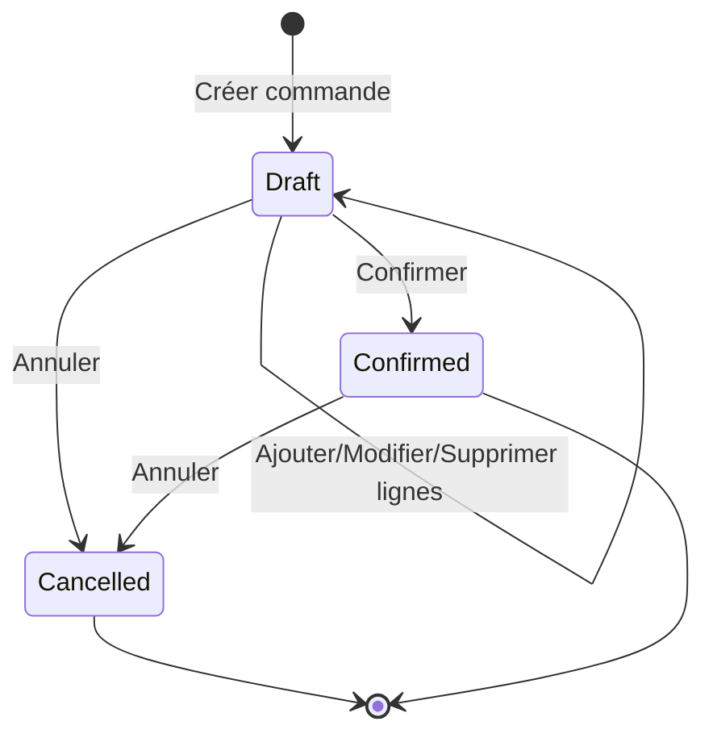

# API Commandes

Documentation complète des endpoints pour la gestion des commandes.

## Obtenir une commande

Récupère une commande spécifique par son ID avec toutes ses lignes.

**Endpoint** : `GET /api/orders/{id}`

**Paramètres** :
- `id` (Guid, required) - Identifiant unique de la commande

**Réponse** : `200 OK`

```json
{
  "id": "5fa85f64-5717-4562-b3fc-2c963f66afa9",
  "status": "Draft",
  "createdAt": "2024-02-13T10:30:00Z",
  "total": 249.98,
  "customerId": "8fa85f64-5717-4562-b3fc-2c963f66afab",
  "lines": [
    {
      "productId": "3fa85f64-5717-4562-b3fc-2c963f66afa6",
      "quantity": 2,
      "unitPrice": 99.99,
      "lineTotal": 199.98
    },
    {
      "productId": "4fa85f64-5717-4562-b3fc-2c963f66afa8",
      "quantity": 1,
      "unitPrice": 50.00,
      "lineTotal": 50.00
    }
  ]
}
```

**Erreurs** :
- `404 Not Found` - Commande non trouvée

**Exemple avec curl** :

```bash
curl -X GET "http://localhost:5069/api/orders/5fa85f64-5717-4562-b3fc-2c963f66afa9" \
  -H "accept: application/json"
```

---

## Créer une commande

Crée une nouvelle commande vide en statut Draft.

**Endpoint** : `POST /api/orders`

**Corps de la requête** :

```json
{
  "customerId": "8fa85f64-5717-4562-b3fc-2c963f66afab"
}
```

**Paramètres** :
- `customerId` : Optionnel, identifiant du client

**Réponse** : `201 Created`

```json
{
  "id": "5fa85f64-5717-4562-b3fc-2c963f66afa9",
  "status": "Draft",
  "createdAt": "2024-02-13T10:30:00Z",
  "total": 0,
  "customerId": "8fa85f64-5717-4562-b3fc-2c963f66afab",
  "lines": []
}
```

**Exemple avec curl** :

```bash
curl -X POST "http://localhost:5069/api/orders" \
  -H "accept: application/json" \
  -H "Content-Type: application/json" \
  -d '{
    "customerId": "8fa85f64-5717-4562-b3fc-2c963f66afab"
  }'
```

---

## Ajouter une ligne

Ajoute un produit à une commande.

**Endpoint** : `POST /api/orders/{id}/lines`

**Paramètres** :
- `id` (Guid, required) - Identifiant de la commande

**Corps de la requête** :

```json
{
  "productId": "3fa85f64-5717-4562-b3fc-2c963f66afa6",
  "quantity": 2
}
```

**Validation** :
- `productId` : Obligatoire, doit correspondre à un produit actif
- `quantity` : Obligatoire, doit être strictement positif (> 0)
- La commande doit être en statut `Draft`

**Réponse** : `204 No Content`

**Erreurs** :
- `404 Not Found` - Commande ou produit non trouvé
- `400 Bad Request` - Commande non modifiable ou produit inactif

```json
{
  "title": "Erreur métier",
  "detail": "La commande n'est plus modifiable."
}
```

**Exemple avec curl** :

```bash
curl -X POST "http://localhost:5069/api/orders/5fa85f64-5717-4562-b3fc-2c963f66afa9/lines" \
  -H "accept: application/json" \
  -H "Content-Type: application/json" \
  -d '{
    "productId": "3fa85f64-5717-4562-b3fc-2c963f66afa6",
    "quantity": 2
  }'
```

---

## Modifier la quantité

Modifie la quantité d'un produit dans une ligne de commande.

**Endpoint** : `PUT /api/orders/{id}/lines`

**Paramètres** :
- `id` (Guid, required) - Identifiant de la commande

**Corps de la requête** :

```json
{
  "productId": "3fa85f64-5717-4562-b3fc-2c963f66afa6",
  "newQuantity": 5
}
```

**Validation** :
- `productId` : Obligatoire, doit exister dans la commande
- `newQuantity` : Obligatoire, doit être strictement positif (> 0)
- La commande doit être en statut `Draft`

**Réponse** : `204 No Content`

**Erreurs** :
- `404 Not Found` - Commande ou ligne non trouvée
- `400 Bad Request` - Commande non modifiable ou quantité invalide

**Exemple avec curl** :

```bash
curl -X PUT "http://localhost:5069/api/orders/5fa85f64-5717-4562-b3fc-2c963f66afa9/lines" \
  -H "accept: application/json" \
  -H "Content-Type: application/json" \
  -d '{
    "productId": "3fa85f64-5717-4562-b3fc-2c963f66afa6",
    "newQuantity": 5
  }'
```

---

## Supprimer une ligne

Retire un produit d'une commande.

**Endpoint** : `DELETE /api/orders/{id}/lines/{productId}`

**Paramètres** :
- `id` (Guid, required) - Identifiant de la commande
- `productId` (Guid, required) - Identifiant du produit à retirer

**Validation** :
- La commande doit être en statut `Draft`
- Le produit doit exister dans la commande

**Réponse** : `204 No Content`

**Erreurs** :
- `404 Not Found` - Commande ou ligne non trouvée
- `400 Bad Request` - Commande non modifiable

**Exemple avec curl** :

```bash
curl -X DELETE "http://localhost:5069/api/orders/5fa85f64-5717-4562-b3fc-2c963f66afa9/lines/3fa85f64-5717-4562-b3fc-2c963f66afa6" \
  -H "accept: application/json"
```

---

## Confirmer une commande

Confirme une commande et la rend non modifiable.

**Endpoint** : `POST /api/orders/{id}/confirm`

**Paramètres** :
- `id` (Guid, required) - Identifiant de la commande

**Validation** :
- La commande doit être en statut `Draft`
- La commande doit contenir au moins une ligne

**Réponse** : `204 No Content`

**Erreurs** :
- `404 Not Found` - Commande non trouvée
- `400 Bad Request` - Commande vide ou déjà confirmée

```json
{
  "title": "Erreur métier",
  "detail": "Impossible de confirmer une commande vide."
}
```

**Exemple avec curl** :

```bash
curl -X POST "http://localhost:5069/api/orders/5fa85f64-5717-4562-b3fc-2c963f66afa9/confirm" \
  -H "accept: application/json"
```

---

## Annuler une commande

Annule une commande.

**Endpoint** : `POST /api/orders/{id}/cancel`

**Paramètres** :
- `id` (Guid, required) - Identifiant de la commande

**Réponse** : `204 No Content`

**Erreurs** :
- `404 Not Found` - Commande non trouvée

**Exemple avec curl** :

```bash
curl -X POST "http://localhost:5069/api/orders/5fa85f64-5717-4562-b3fc-2c963f66afa9/cancel" \
  -H "accept: application/json"
```

---

## Cycle de vie d'une commande



### États possibles

| État | Description | Modifiable |
|------|-------------|------------|
| **Draft** | Commande en cours de création | ✅ Oui |
| **Confirmed** | Commande confirmée | ❌ Non |
| **Cancelled** | Commande annulée | ❌ Non |

## Règles métier

### Modification des lignes

- Les lignes ne peuvent être modifiées que si la commande est en statut `Draft`
- Une commande confirmée ou annulée est **immuable**

### Validation des produits

- Seuls les produits **actifs** peuvent être ajoutés à une commande
- Le prix unitaire est capturé au moment de l'ajout (snapshot)

### Confirmation

- Une commande doit contenir **au moins une ligne** pour être confirmée
- Une fois confirmée, la commande ne peut plus être modifiée
- Une commande confirmée peut être annulée

### Calcul du total

Le total de la commande est calculé automatiquement :
```
Total = Σ (quantité × prix unitaire) pour chaque ligne
```

## Exemples d'utilisation

### Scénario complet : Créer et confirmer une commande

```bash
# 1. Créer une commande vide
ORDER_ID=$(curl -X POST "http://localhost:5069/api/orders" \
  -H "Content-Type: application/json" \
  -d '{"customerId": "8fa85f64-5717-4562-b3fc-2c963f66afab"}' \
  | jq -r '.id')

# 2. Ajouter des produits
curl -X POST "http://localhost:5069/api/orders/$ORDER_ID/lines" \
  -H "Content-Type: application/json" \
  -d '{
    "productId": "3fa85f64-5717-4562-b3fc-2c963f66afa6",
    "quantity": 2
  }'

curl -X POST "http://localhost:5069/api/orders/$ORDER_ID/lines" \
  -H "Content-Type: application/json" \
  -d '{
    "productId": "4fa85f64-5717-4562-b3fc-2c963f66afa8",
    "quantity": 1
  }'

# 3. Modifier une quantité
curl -X PUT "http://localhost:5069/api/orders/$ORDER_ID/lines" \
  -H "Content-Type: application/json" \
  -d '{
    "productId": "3fa85f64-5717-4562-b3fc-2c963f66afa6",
    "newQuantity": 3
  }'

# 4. Vérifier la commande
curl -X GET "http://localhost:5069/api/orders/$ORDER_ID"

# 5. Confirmer la commande
curl -X POST "http://localhost:5069/api/orders/$ORDER_ID/confirm"

# 6. Tenter de modifier (devrait échouer)
curl -X POST "http://localhost:5069/api/orders/$ORDER_ID/lines" \
  -H "Content-Type: application/json" \
  -d '{
    "productId": "4fa85f64-5717-4562-b3fc-2c963f66afa8",
    "quantity": 5
  }'
# Erreur: "La commande n'est plus modifiable."
```

## Codes de statut HTTP

| Code | Signification | Utilisation |
|------|---------------|-------------|
| 200 | OK | Requête GET réussie |
| 201 | Created | Commande créée avec succès |
| 204 | No Content | Opération réussie (POST, PUT, DELETE) |
| 400 | Bad Request | Données invalides ou règle métier violée |
| 404 | Not Found | Commande ou produit non trouvé |
| 500 | Internal Server Error | Erreur serveur |
