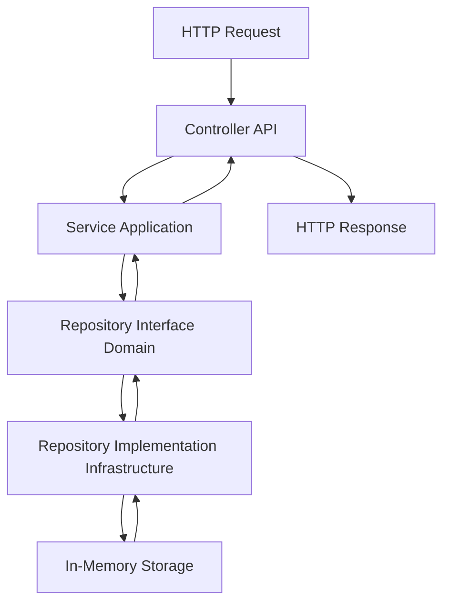
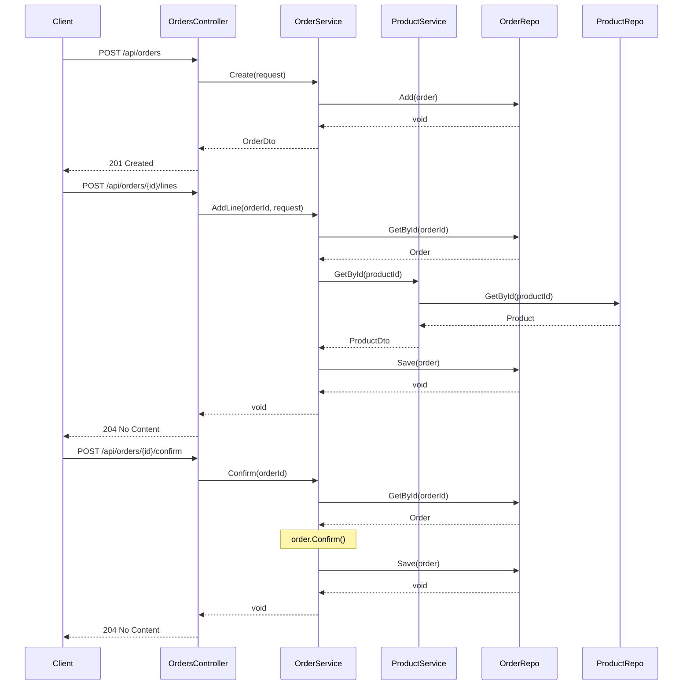

# Architecture du projet

## Vue d'ensemble

AdvancedDevSample suit une **architecture en couches** basée sur les principes du **Domain-Driven Design (DDD)**. Cette architecture garantit une séparation claire des responsabilités et facilite la maintenabilité du code.

## Couches de l'application

### 1. Domain (Domaine)

**Responsabilité** : Contient la logique métier pure et les règles invariantes.

**Composants** :
- **Entities** : Objets avec une identité unique (Product, Order, Customer, Supplier)
- **Value Objects** : Objets sans identité définis par leurs valeurs (Price, OrderLine)
- **Interfaces** : Contrats pour les repositories
- **Exceptions** : Exceptions métier (DomainException)

**Règles** :
- ✅ Aucune dépendance vers les autres couches
- ✅ Logique métier pure
- ✅ Invariants garantis par les entités

### 2. Application

**Responsabilité** : Orchestration des cas d'usage et coordination du domaine.

**Composants** :
- **Services** : Services applicatifs (ProductService, OrderService, CustomerService, SupplierService)
- **DTOs** : Objets de transfert de données
- **Exceptions** : Exceptions applicatives (ApplicationServiceException)

**Règles** :
- ✅ Dépend uniquement du Domain
- ✅ Pas de logique métier, uniquement de l'orchestration
- ✅ Transforme les entités en DTOs

### 3. Infrastructure

**Responsabilité** : Implémentation technique des interfaces du domaine.

**Composants** :
- **Repositories** : Implémentations en mémoire des repositories
- **Entities** : Entités de persistence (ProductEntity, CustomerEntity, SupplierEntity)

**Règles** :
- ✅ Implémente les interfaces du Domain
- ✅ Gère la persistance des données
- ✅ Mapping entre entités de domaine et de persistence

### 4. API

**Responsabilité** : Exposition des fonctionnalités via une API REST.

**Composants** :
- **Controllers** : Contrôleurs REST (ProductsController, OrdersController, CustomersController, SuppliersController)
- **Middlewares** : Gestion globale des erreurs
- **Program.cs** : Configuration de l'application et injection de dépendances

**Règles** :
- ✅ Dépend de Application et Infrastructure
- ✅ Gère les requêtes HTTP
- ✅ Validation des entrées
- ✅ Gestion des erreurs HTTP

### 5. Test

**Responsabilité** : Tests unitaires et d'intégration.

**Composants** :
- **Domain/Entities** : Tests des entités métier
- **Application/Services** : Tests des services applicatifs
- **Application/Fakes** : Faux repositories pour les tests
- **API/Integration** : Tests d'intégration de l'API

## Flux de données



## Diagramme de séquence - Création d'une commande



## Principes DDD appliqués

### Entités vs Value Objects

**Entités** (avec identité) :
- `Product` - Identifié par son `Id`
- `Order` - Identifié par son `Id`
- `Customer` - Identifié par son `Id`
- `Supplier` - Identifié par son `Id`

**Value Objects** (sans identité) :
- `Price` - Défini par sa valeur
- `OrderLine` - Défini par ProductId, Quantity, UnitPrice

### Invariants métier

Les invariants sont garantis par les entités :

**Product** :
- Le prix doit être strictement positif
- Un produit inactif ne peut pas changer de prix

**Order** :
- Une commande confirmée ou annulée n'est plus modifiable
- Une commande ne peut être confirmée que si elle contient au moins une ligne
- Chaque ligne a une quantité strictement positive

**Customer / Supplier** :
- Le nom ne peut pas être vide
- L'email doit avoir un format valide

### Agrégats

- **Product** : Agrégat simple
- **Order** : Agrégat racine contenant des OrderLines

## Injection de dépendances

L'injection de dépendances est configurée dans `Program.cs` :

```csharp
// Repositories
builder.Services.AddScoped<IProductRepository, EfProductRepository>();
builder.Services.AddScoped<IOrderRepository, InMemoryOrderRepository>();
builder.Services.AddScoped<ICustomerRepository, InMemoryCustomerRepository>();
builder.Services.AddScoped<ISupplierRepository, InMemorySupplierRepository>();

// Services
builder.Services.AddScoped<ProductService>();
builder.Services.AddScoped<OrderService>();
builder.Services.AddScoped<CustomerService>();
builder.Services.AddScoped<SupplierService>();
```

## Gestion des erreurs

### Hiérarchie des exceptions

1. **DomainException** : Violation des règles métier
2. **ApplicationServiceException** : Ressource non trouvée
3. **InfrastructureException** : Erreur technique

### Middleware de gestion des erreurs

Le `ExceptionHandlingMiddleware` capture toutes les exceptions et retourne des réponses HTTP appropriées :

- `DomainException` → 400 Bad Request
- `ApplicationServiceException` → 404 Not Found
- `InfrastructureException` → 500 Internal Server Error
- `Exception` → 500 Internal Server Error

## Avantages de cette architecture

✅ **Testabilité** : Chaque couche peut être testée indépendamment  
✅ **Maintenabilité** : Séparation claire des responsabilités  
✅ **Évolutivité** : Facile d'ajouter de nouvelles fonctionnalités  
✅ **Indépendance technologique** : Le domaine ne dépend d'aucune technologie  
✅ **Réutilisabilité** : La logique métier peut être réutilisée dans différents contextes
