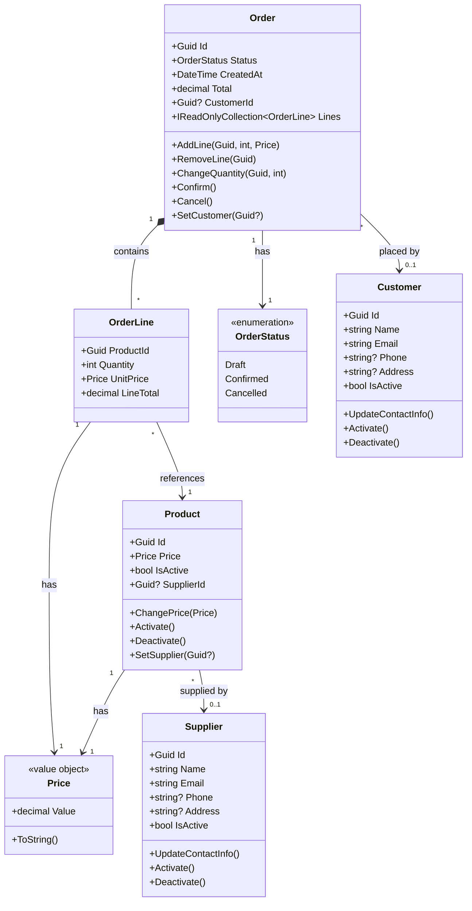
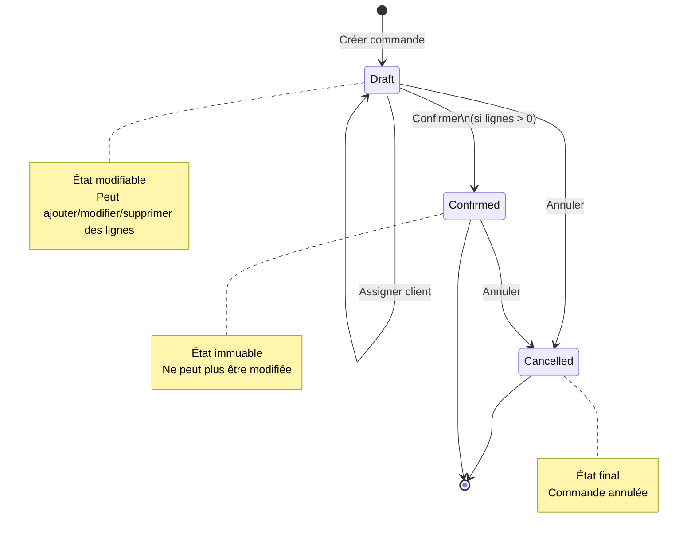
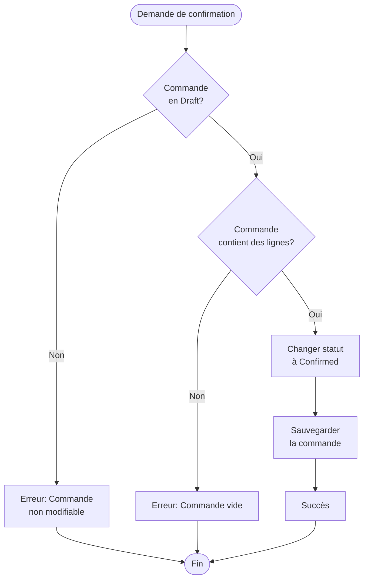

# Modèle de domaine

Ce document décrit les entités métier, les value objects et les règles du domaine.

## Entités

### Product (Produit)

Représente un produit vendable dans le catalogue.

**Propriétés** :
- `Id` (Guid) - Identifiant unique
- `Price` (Price) - Prix du produit (Value Object)
- `IsActive` (bool) - Statut actif/inactif

**Invariants** :
- Le prix doit être strictement positif
- Un produit inactif ne peut pas changer de prix

**Méthodes** :
- `ChangePrice(Price newPrice)` - Modifier le prix
- `ChangePrice(decimal newPriceValue)` - Modifier le prix (surcharge)
- `Activate()` - Activer le produit
- `Deactivate()` - Désactiver le produit

### Order (Commande)

Représente une commande client contenant une ou plusieurs lignes de produits.

**Propriétés** :
- `Id` (Guid) - Identifiant unique
- `Lines` (IReadOnlyCollection<OrderLine>) - Lignes de commande
- `Status` (OrderStatus) - Statut de la commande
- `CreatedAt` (DateTime) - Date de création
- `Total` (decimal) - Total calculé

**Invariants** :
- Une commande Confirmed ou Cancelled n'est plus modifiable
- Chaque ligne a une quantité strictement positive
- Une commande ne peut être confirmée que si elle contient au moins une ligne

**Méthodes** :
- `AddLine(Guid productId, int quantity, Price unitPrice)` - Ajouter une ligne
- `RemoveLine(Guid productId)` - Supprimer une ligne
- `ChangeQuantity(Guid productId, int newQuantity)` - Modifier la quantité
- `Confirm()` - Confirmer la commande
- `Cancel()` - Annuler la commande

**Statuts** :
- `Draft` (0) - Brouillon, modifiable
- `Confirmed` (1) - Confirmée, non modifiable
- `Cancelled` (2) - Annulée, non modifiable

### Customer (Client)

Représente un client qui peut passer des commandes.

**Propriétés** :
- `Id` (Guid) - Identifiant unique
- `Name` (string) - Nom du client
- `Email` (string) - Email du client
- `Phone` (string?) - Téléphone (optionnel)
- `Address` (string?) - Adresse (optionnel)
- `IsActive` (bool) - Statut actif/inactif

**Invariants** :
- Le nom ne peut pas être vide
- L'email doit avoir un format valide

**Méthodes** :
- `UpdateContactInfo(string name, string email, string? phone, string? address)` - Mettre à jour les informations
- `Activate()` - Activer le client
- `Deactivate()` - Désactiver le client

### Supplier (Fournisseur)

Représente un fournisseur qui fournit des produits.

**Propriétés** :
- `Id` (Guid) - Identifiant unique
- `Name` (string) - Nom du fournisseur
- `Email` (string) - Email du fournisseur
- `Phone` (string?) - Téléphone (optionnel)
- `Address` (string?) - Adresse (optionnel)
- `IsActive` (bool) - Statut actif/inactif

**Invariants** :
- Le nom ne peut pas être vide
- L'email doit avoir un format valide

**Méthodes** :
- `UpdateContactInfo(string name, string email, string? phone, string? address)` - Mettre à jour les informations
- `Activate()` - Activer le fournisseur
- `Deactivate()` - Désactiver le fournisseur

## Value Objects

### Price (Prix)

Représente un prix strictement positif.

**Propriétés** :
- `Value` (decimal) - Valeur du prix

**Invariants** :
- La valeur doit être strictement positive (> 0)

**Méthodes** :
- `ToString()` - Formatage avec 2 décimales

### OrderLine (Ligne de commande)

Représente une ligne de commande : produit + quantité + prix unitaire.

**Propriétés** :
- `ProductId` (Guid) - Identifiant du produit
- `Quantity` (int) - Quantité commandée
- `UnitPrice` (Price) - Prix unitaire
- `LineTotal` (decimal) - Total de la ligne (calculé)

**Invariants** :
- ProductId ne peut pas être vide
- Quantity doit être strictement positif
- UnitPrice est un Price valide

## Diagramme de classes

## Diagramme d'état-transition - Cycle de vie d'une commande

## Diagramme d'activité - Processus de confirmation de commande

## Règles métier

### Gestion des prix

1. Un prix doit toujours être strictement positif
2. Un produit inactif ne peut pas changer de prix
3. Le prix d'une ligne de commande est figé au moment de l'ajout

### Gestion des commandes

1. Une commande est créée en statut Draft
2. On peut ajouter/modifier/supprimer des lignes uniquement en statut Draft
3. Une commande ne peut être confirmée que si elle contient au moins une ligne
4. Une fois confirmée ou annulée, une commande ne peut plus être modifiée
5. Le total est calculé automatiquement à partir des lignes

### Gestion des clients et fournisseurs

1. Le nom et l'email sont obligatoires
2. L'email doit avoir un format valide
3. Le téléphone et l'adresse sont optionnels
4. Un client/fournisseur peut être activé ou désactivé
