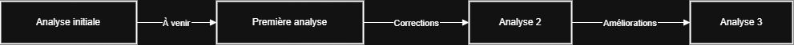

# Qualité du Code avec SonarQube

Documentation des métriques de qualité et des résultats d'analyse SonarQube pour le projet AdvancedDevSample.

## Vue d'ensemble

SonarQube est utilisé pour analyser la qualité du code et identifier les problèmes potentiels de :
- **Bugs** : Erreurs de code
- **Vulnerabilities** : Failles de sécurité
- **Code Smells** : Problèmes de maintenabilité
- **Coverage** : Couverture de tests
- **Duplications** : Code dupliqué

## Métriques du projet

### Résumé des métriques

| Métrique | Valeur | Objectif | Statut |
|----------|--------|----------|--------|
| **Bugs** | À analyser | 0 | ⏳ En attente |
| **Vulnerabilities** | À analyser | 0 | ⏳ En attente |
| **Code Smells** | À analyser | < 50 | ⏳ En attente |
| **Coverage** | À analyser | ≥ 80% | ⏳ En attente |
| **Duplications** | À analyser | < 3% | ⏳ En attente |
| **Technical Debt** | À analyser | < 5% | ⏳ En attente |

> [!NOTE]
> Ces métriques seront mises à jour après la première analyse SonarQube.

---

## Quality Gate

Le **Quality Gate** définit les critères de qualité minimum pour le projet.

### Critères par défaut

- ✅ **Couverture** : Nouveau code couvert à ≥ 80%
- ✅ **Duplications** : Nouveau code dupliqué < 3%
- ✅ **Maintenabilité** : Note de maintenabilité ≥ A
- ✅ **Fiabilité** : Note de fiabilité ≥ A
- ✅ **Sécurité** : Note de sécurité ≥ A

### Statut actuel

```
Quality Gate: ⏳ EN ATTENTE D'ANALYSE
```

---

## Analyse par couche

### Domain Layer

**Responsabilité** : Logique métier pure

**Métriques attendues** :
- Couverture : ≥ 90% (logique critique)
- Complexité cyclomatique : < 10 par méthode
- Code Smells : Minimal

**Fichiers clés** :
- `Product.cs`
- `Order.cs`
- `Customer.cs`
- `Supplier.cs`
- `User.cs`

### Application Layer

**Responsabilité** : Orchestration et services

**Métriques attendues** :
- Couverture : ≥ 85%
- Duplications : < 2%

**Fichiers clés** :
- `ProductService.cs`
- `OrderService.cs`
- `AuthService.cs`

### Infrastructure Layer

**Responsabilité** : Persistence et implémentations techniques

**Métriques attendues** :
- Couverture : ≥ 70%
- Code Smells : Acceptable (code technique)

### API Layer

**Responsabilité** : Endpoints REST

**Métriques attendues** :
- Couverture : ≥ 75%
- Sécurité : Aucune vulnérabilité

---

## Problèmes identifiés

### Bugs

> Aucun bug identifié pour le moment. Cette section sera mise à jour après l'analyse.

### Vulnerabilities

> Aucune vulnérabilité identifiée pour le moment. Cette section sera mise à jour après l'analyse.

### Code Smells

> Aucun code smell identifié pour le moment. Cette section sera mise à jour après l'analyse.

---

## Évolution des métriques

### Historique



Ce diagramme montre l'évolution prévue des analyses de qualité au fil du temps.


### Tendances

Les tendances seront suivies au fil du temps :
- 📈 Amélioration de la couverture de tests
- 📉 Réduction de la dette technique
- 🎯 Maintien du Quality Gate

---

## Bonnes pratiques appliquées

### 1. Tests unitaires complets

- ✅ Tous les services ont des tests
- ✅ Toutes les entités ont des tests
- ✅ Couverture actuelle : **50 tests passent**

### 2. Séparation des responsabilités

- ✅ Architecture en couches (DDD)
- ✅ Injection de dépendances
- ✅ Interfaces pour l'abstraction

### 3. Gestion des erreurs

- ✅ Exceptions métier (`DomainException`)
- ✅ Exceptions applicatives (`ApplicationServiceException`)
- ✅ Middleware de gestion globale

### 4. Sécurité

- ✅ Authentification JWT
- ✅ Hashing BCrypt pour les mots de passe
- ✅ Validation des entrées

---

## Recommandations

### Priorité haute

1. **Lancer la première analyse SonarQube**
   ```bash
   dotnet sonarscanner begin /k:"AdvancedDevSample" /d:sonar.host.url="http://localhost:9000" /d:sonar.token="VOTRE_TOKEN"
   dotnet build
   dotnet test
   dotnet sonarscanner end /d:sonar.token="VOTRE_TOKEN"
   ```

2. **Corriger les bugs critiques** identifiés

3. **Résoudre les vulnérabilités de sécurité**

### Priorité moyenne

1. **Améliorer la couverture de tests** pour atteindre 80%
2. **Réduire les duplications de code**
3. **Simplifier le code complexe** (complexité cyclomatique > 10)

### Priorité basse

1. **Corriger les code smells mineurs**
2. **Améliorer la documentation du code**
3. **Optimiser les performances**

---

## Intégration continue

### Analyse automatique

L'analyse SonarQube peut être intégrée dans votre pipeline CI/CD :

```yaml
# .github/workflows/sonarqube.yml
- name: SonarQube Analysis
  run: |
    dotnet sonarscanner begin /k:"AdvancedDevSample" /d:sonar.host.url="${{ secrets.SONAR_HOST_URL }}" /d:sonar.token="${{ secrets.SONAR_TOKEN }}"
    dotnet build
    dotnet test
    dotnet sonarscanner end /d:sonar.token="${{ secrets.SONAR_TOKEN }}"
```

### Quality Gate dans les PR

Configurez votre repository pour :
- ❌ Bloquer les PR qui ne passent pas le Quality Gate
- ✅ Afficher les métriques dans les PR
- 📊 Suivre l'évolution de la qualité

---

## Ressources

- [Guide d'installation SonarQube](sonarqube-setup.md)
- [Dashboard SonarQube](http://localhost:9000/dashboard?id=AdvancedDevSample)
- [Documentation SonarQube](https://docs.sonarqube.org/latest/)

---

## Prochaines étapes

1. [ ] Installer SonarQube (voir [sonarqube-setup.md](sonarqube-setup.md))
2. [ ] Lancer la première analyse
3. [ ] Analyser les résultats
4. [ ] Corriger les problèmes critiques
5. [ ] Mettre à jour ce document avec les métriques réelles
6. [ ] Configurer l'intégration CI/CD
